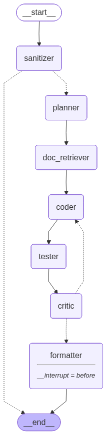

# CodeGen Agent

A LangGraph-based autonomous code generation system that iteratively refines code through a multi-agent pipeline.

## Overview

CodeGen Agent takes a natural language task description and produces working, tested code through a structured agent workflow. It uses OpenAI's GPT-4o model as the underlying LLM and supports retrieval-augmented generation from PDF documentation.

## Graph

```mermaid




### Agents

| Agent | Purpose |
|-------|---------|
| **Sanitizer** | Validates input, detects prompt injection, rejects dangerous requests |
| **Planner** | Analyzes task, detects programming language, extracts atomic requirements |
| **Doc Retriever** | Retrieves relevant context from Chroma vector store (optional) |
| **Coder** | Generates implementation code based on requirements |
| **Tester** | Writes unit tests using `unittest` framework |
| **Critic** | Reviews code against requirements, approves or requests revision |
| **Formatter** | Produces final markdown output with approach, implementation, tests, usage |

### Iteration Loop

The Coder → Tester → Critic loop runs up to `max_iterations` (default: 3) until the critic approves or the iteration cap is reached.

## Installation

```bash
# Create and activate virtual environment
python -m venv .venv
.venv\Scripts\activate.ps1  # Windows

# Install dependencies
pip install -e .
```

## Configuration

Create a `.env` file:

```env
OPENAI_API_KEY=sk-...
OPENAI_MODEL=gpt-4o
OPENAI_TEMPERATURE=0.2

# Optional: LangSmith for tracing
LANGSMITH_API_KEY=...
LANGSMITH_PROJECT=...

# Checkpointer (default: memory)
CHECKPOINTER=memory  # or: sqlite, postgres
```

## Usage

```bash
python -m codegen_agent "Write a function that calculates the Fibonacci sequence"
```

### Programmatic Usage

```python
import asyncio
from codegen_agent.config import get_llm, get_runtime_checkpointer
from codegen_agent.graph import build_graph

async def main():
    llm = get_llm()
    async with get_runtime_checkpointer() as checkpointer:
        graph = build_graph(llm, checkpointer)
        async for event in graph.astream({"task": "Your task here"}):
            print(event)

asyncio.run(main())
```

## Project Structure

```
codegen_agent/
├── config.py          # LLM and checkpointer configuration
├── graph.py           # LangGraph state graph definition
├── state.py           # CodeGenState TypedDict
├── logger.py          # JSON-structured logging
├── main.py            # CLI entry point
├── agents/
│   ├── sanitizer.py   # Input validation & security
│   ├── planner.py     # Task analysis & requirement extraction
│   ├── coder.py       # Code generation
│   ├── tester.py      # Unit test creation
│   ├── critic.py      # Code review & approval
│   └── formatter.py   # Final output generation
└── tools/
    └── doc_retriever.py  # Chroma-based documentation retrieval

scripts/
├── ingest_docs.py     # Ingest PDF docs into Chroma
└── save_graph.py      # Export graph visualization

tests/                 # Pytest test suite
```

## Documentation Ingestion

To enable RAG-based context retrieval:

```bash
python scripts/ingest_docs.py <path-to-pdf> <collection-name>
```

## Testing

```bash
pytest tests/
```

## Dependencies

- **LangGraph** — State graph orchestration
- **LangChain** — LLM framework
- **Chroma** — Vector database for doc retrieval
- **OpenAI** — LLM provider
- **python-dotenv** — Environment variable management